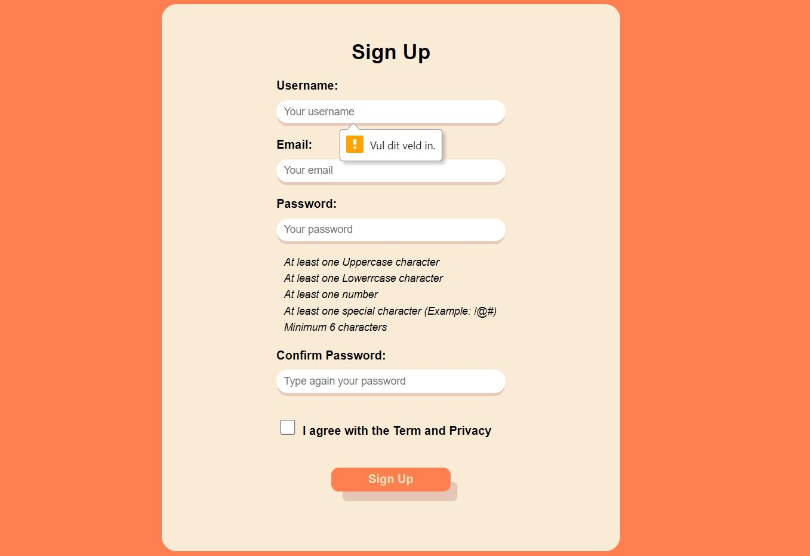
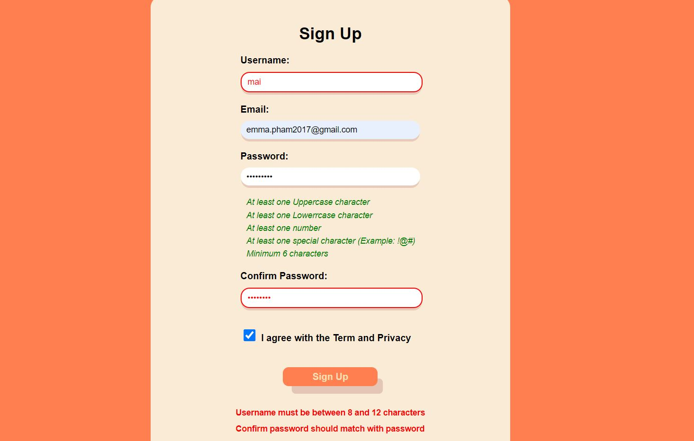
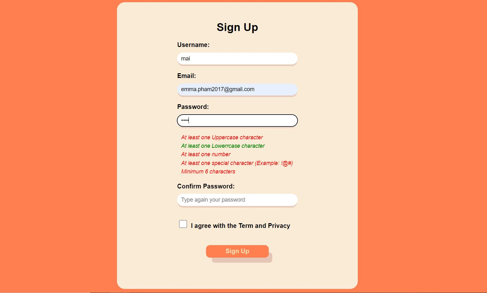

# Sign Up Validation

In this project, I focused on using javascript to validate the form of sign up.

- Username must be between 8 and 12 characters
- Confirm password should match with password
- Password should : + At least one Uppercase character + At least one Lowerrcase character + At least one number + At least one special character (Example: !@#) + Minimum 6 characters

The project is made in few hours by using HTML, CSS and Javascript

# Screenshots

